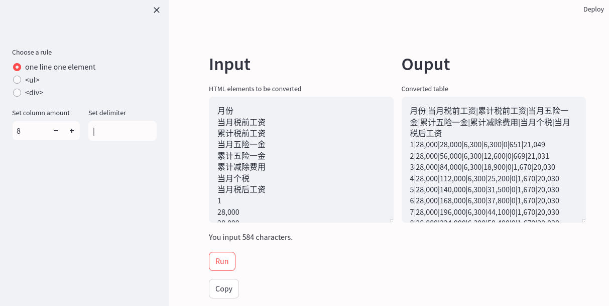

# streamlit-html2table
This is a [Streamlit](https://streamlit.io/) web app, which can convert html text or raw text to table for sheet application, like Excel or WPS.

# Start
```
git clone git@github.com:wffger/streamlit-html2table.git
cd streamlit-html2table
py -m venv venv
source venv/bin/acticate

py -m pip install -r requirements.txt


streamlit run main2.py
# or
streamlit run main.py
```
# Rules
There are 3 rules for conversion:
1. one line one element
2. `<ul>`
3. `<div>`


# View
